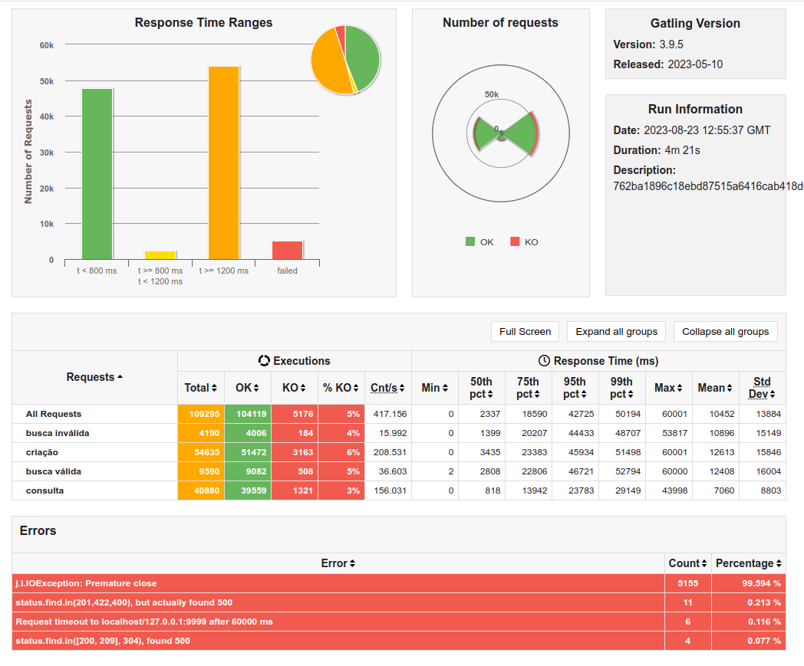

# Rinha de Backend

O [@zanfranceschi](https://twitter.com/zanfranceschi) lançou a braba no twitter e a galera da bolhadev abraçou.

Na hora pensei, vou fazer sem framework, so servlet e jdbc e nasceu essa bagaça. Mas teve maluco que fez em [bash](https://github.com/leandronsp/rinha-backend-bash)



Relatorio: [gatling](https://davidlins.github.io/rinha-backend/rinhabackendsimulation-20230823125535906/)

## Desafio

Para mais detalhes: [rinha do backend](https://github.com/zanfranceschi/rinha-de-backend-2023-q3)

## Requirements

* [OpenJDK JDK 20](https://jdk.java.net/20)
* [Maven 3.9.3](https://maven.apache.org/)
* [Podman Compose](https://github.com/containers/podman-compose) ou [Docker Compose](https://docs.docker.com/compose/)
* [Gatling](https://gatling.io/open-source/)

## Stack

* [Jakarta Servlet 6.0](https://jakarta.ee/specifications/servlet/6.0/)
* [PostgreSQL](https://www.postgresql.org/)
* [NGINX](https://www.nginx.com/)
* [Jetty](https://projects.eclipse.org/projects/rt.jetty/releases/12.0)


## Subindo o ambiente

```bash
$ podman-compose up -d

```

## Torando a Api

Instale o [Gatling](https://gatling.io/open-source/) e altere a variável "GATLING_BIN_DIR" no arquivo stress-test/run-test.sh

```bash
$ cd stress-test 
$ ./run-test.sh
```

## Agradecimentos

Primeiro para o [@zanfranceschi](https://twitter.com/zanfranceschi) que através dessa brincadeira fomentou uma troca de conhecimento em a bolhadev, eu aprendi muito nesse desafio, implementando minha solução, chupinhando os amiguinhos e vendo soluções em outras stacks.

A esse [@rinhadebackend](https://twitter.com/rinhadebackend) que agregou toda a treta (do bem) no twitter.

Se você quiser chupinhar também:

*  [Rodrigo Navarro](https://github.com/reu/rinha-backend-rust)
*  [Leandro Proença](https://github.com/leandronsp/rinha-backend-ruby)
*  [Claudson Oliveira](https://github.com/filhodanuvem/rinha-backend-2023-go)
*  [Hugo Masques](https://github.com/hugomarques/rinha-backend-2023-q3-java)
 
